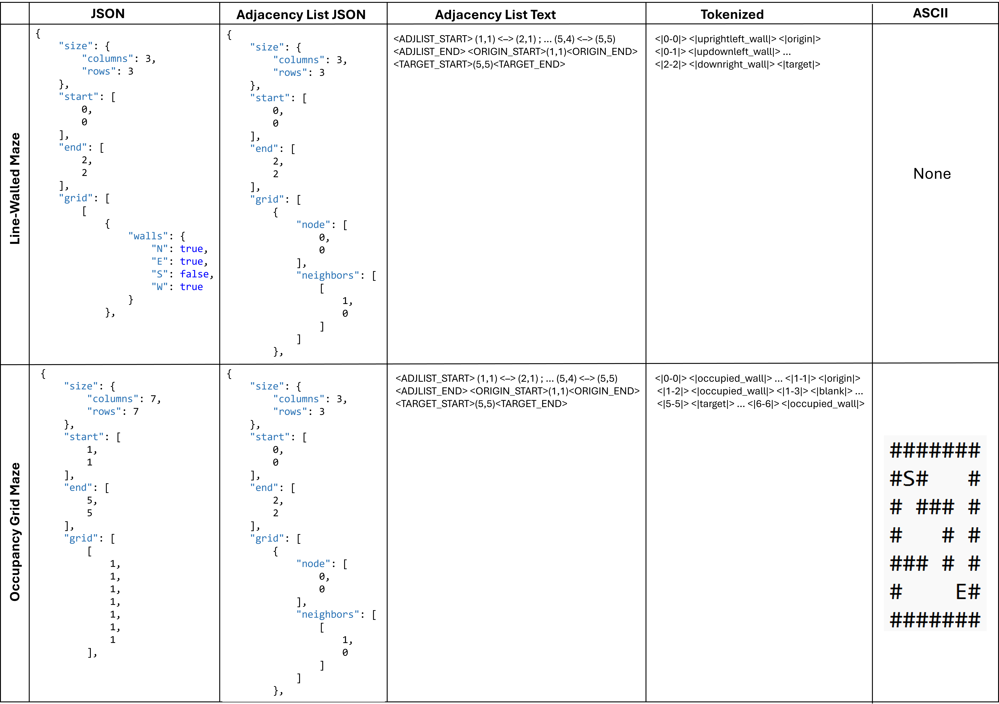

# Prompting LLMs With Perfect Mazes To Investigate Their Ability For Reasoning, Spatial Understanding and Navigation
This project contains codes, datasets, and results that were used to test LLM's ability of spatial reasoning.\
This thesis was created to obtain a master's degree in robotics engineering from Delft University of Technology. The full paper is available in this repository. Below is the abstract.

**Abstract** \
Current evaluations of Large Language Model (LLM) spatial reasoning focus on several isolated competencies rather than a unified task, and use an array of different input formats, leaving it unclear how input representation and output frame of reference influence performance on navigation tasks. This study asks: how do spatial representations and frames of reference influence LLMs' spatial reasoning capabilities, and which combinations are conducive to spatial reasoning?\
This research investigates the spatial reasoning and navigation capabilities of reasoning and non-reasoning LLMs. Using perfect mazes as a controlled testbed, the study examines how various input representations, including visual (JPG and ASCII), grid-based (JSON and Tagged per-cell), and graph-based (Adjacency List) formats, interact with different output Frames of Reference (FoRs) to influence model performance.\
The methodology involves an evaluation using Gemini 2.5 Pro (reasoning) and Gemini 2.5 Flash-Lite (non-reasoning) across 11 maze representations and three output frames: allocentric using absolute coordinates ("coordinates"), allocentric using absolute directions ("allocentric"), and egocentric (relative directions). Performance is measured through a "completion score", the percentage of the path navigated correctly before the first error, and "output tokens" to assess efficiency.\
There are three key findings regarding the optimal representation, impact of the frame of reference, and model reasoning behaviors. First, structured graph-based representations, particularly Adjacency List JSON (a graph-based representation formatted as JSON file), consistently yield the highest performance for both model types. Second, models perform significantly better when answering in absolute coordinates. Egocentric outputs, which require continuous relational analysis and state tracking, result in the lowest completion scores, often approaching 0\% in non-reasoning models. Third, analysis of internal reasoning traces shows that the use of formal graph-solving algorithms is positively correlated with success, while exclusive reliance on heuristics or unfounded declarations of confidence is negatively correlated with completion scores.\
The results suggest that LLM spatial reasoning is highly dependent on input formatting and that while models can often plan valid paths, they struggle to translate them into different FoRs. By systematically varying input representation and output FoR this work provides the first integrated evaluation of these factors, addressing the lack of unified benchmarks and clarifying how methodological choices shape observed LLM spatial reasoning performance.



## Index
* [Setup](#setup)
* [How to clone this repository](#how-to-clone-this-repository)
* [Structure of this project](#structure-of-this-project)
* [Creating a dataset](#creating-a-dataset)
* [Calling the API](#calling-the-api)


## Setup
This project uses Python version 3.11.4 and all instructions are specifically for Windows systems. If you are familiar with setting up environments and API keys, skip to the section [How to set up dependencies](#how-to-set-up-dependencies) for a full list of necessary installs. 


### How to set up the virtual environment
All instructions are for Windows.

1. In an Anaconda prompt window, navigate to the folder where you cloned or forked this repository to. We will refer to this folder as 'LLM_maze_solver'.
2. To create the environment (called 'my_env'), in the Anaconda commandline type the following:
```
 conda create -n my_env python=3.11.4
```
reply 'yes' to complete the installation.


3. To activate the environment, again navigate to the folder that contains the environment ( */LLM_maze_solver/ )  in the Anaconda prompt window, and use:
```
conda acivate my_env
```
To deactivate the environment, use:
```
conda deactivate
```
4. Add the virtual environment directory to your .gitignore file


### How to enable API calling
1. Inside your project folder ('*/LLM_maze_solver/' in the previous steps), create a file called '.env'

2. Add the .env file to your .gitignore file.
3. Inside the .env file, add your key. Make sure it is called 'GEMINI_API_KEY' as this is called in the tesT.py and tesT_2.py files. 
```
GEMINI_API_KEY = "YOUR_SECRET_API_KEY_HERE"
```


### How to set up dependencies
Inside your virtual environment, use this version of python and install the following libraries:

```
Python 3.11.4
NumPy 
Matplotlib 
Scipy 
Pandas 
PIL/Pillow: may be automatically included in the Matplotlib installation
Dataframe_image
Google Genai: to call Google Gemini API
```
by running the following Windows commands in the Anaconda prompt while the environment is active. PIL/Pillow may be automatically included in the Matplotlib installation.
```
pip install numpy
```
```
pip install matplotlib
```
```
pip install pillow
```
```
python -m pip install scipy
```
```
pip install pandas
```
```
pip install dataframe_image
```
```
pip install google-generativeai python-dotenv google-genai
```

## How to clone this repository
For instructions on how to clone this repository on a Windows operating system, follow the instructions in [this video](https://www.youtube.com/watch?v=LtpFR07iGs8) starting at 1:35.

## Structure of this project
```
    LLM_maze_solver/
    |───my_env/ (virtual environment optional, if you followed the setup instructions in full)
    |   README.md
    |   .env    (not imported from Git, make your own as explained above)
    |   maze_generator_ext_v3.py    
    |   create_dataset.py           
    |   create_dataset_of_same_complexity.py  
    |   tesT.py                     
    |   tesT_2.py   
    |   results_Dataset03_3x3.py    
    |   results_Dataset03_6x6.py
    |   results_Dataset03_15x15.py  
    |   keyword_search.py          
    |   score_saver.py
    |   token_count_extracter.py
    |───Charts_Dataset03/   (directory that contains all chart-plotting code)
    |───Results_charts      (contains all resulting chart images)
    |───Dataset 01/
    |───Dataset 02 - Statistical analysis/
    |───Dataset 03
    |   |   Dataset 03 3x3 01
    |   |   Dataset 03 3x3 02
    |   |   ... 
```

* maze_generator__ext_v3.py 
    * A python script that randomly generates perfect mazes of a specified gridsize. It contains three classes; Cell( ), Maze( ) and OccupancyGridMaze(Maze). The Maze() class uses the Cell( ) object to generate mazes with lines for walls. The OccupancyGridMaze(Maze) class takes the previous Maze object and  transforms it into an occupancy grid maze. For both maze styles, the classes output a JPG, JSON, ASCII, tokenized, textual adjacency list and JSON adjacency list representation. 
    The Maze( ) class uses Randomized Depth-First Search (DFS) to generate the mazes, and Breadth-First Search (BFS) is used to solve the mazes. The solution to the maze is saved and output as a text file, optionally also as a red line in the image output. 

* create_dataset.py
    * A python script that calls maze_generator_ext_v3.py to create datasets of mazes with various sizes and saves them in a predetermined folder of your choice (in the case of our final dataset: 'Dataset 03'). The maximum nxn size of the mazes can be specified by the user in the main( ) function. 

* create_dataset_of_same_complexity.py  
    * A python script that calls maze_generator_ext_v3.py to create a whole dataset of nxn mazes and saves them in a predetermined folder of your choice (in the case of our final dataset: 'Dataset 03'). The nxn size of the mazes can be specified by the user in the main( ) function. 
    
* tesT.py
    * **Main file used for testing**: A python file that imports existing mazes from a user-specified child directory (in the case of the final tests, this directory is 'Dataset 03/Dataset 03 {Maze rows}x{Maze cols}'). All representations of this maze are iteratively used to prompt a non-reasoning LLM to solve the maze. The LLM's response is saved and automatically scored against the ground-truth solution and saved in a single .md file inside the maze's folder. 

* tesT_2.py
    * **Main file used for testing**: A python file that imports existing mazes from a user-specified child directory (in the case of the final tests, this directory is 'Dataset 03/Dataset 03 {Maze rows}x{Maze cols}'). All representations of this maze are iteratively used to prompt a reasoning LLM to solve the maze. The LLM's response is saved as a tuple of [final answer (str), thought summary (str)] and automatically scored against the ground-truth solution and saved in a single .md file inside the maze's folder. 
* score_saver.py
    * A python script that stores the scores and token counts from tesT.py and tesT_2.py in numpy arrays in multiple files called 'scores_Dataset03_{Maze rows}x{Maze cols}.py', 'prompt_tokens_Dataset03_{Maze rows}x{Maze cols}.py', 'output_tokens_Dataset03_{Maze rows}x{Maze cols}.py', and 'raw_scores_Dataset03_{Maze rows}x{Maze cols}.py', though the names of these files can be changed to your preference. These arrays can be used to create charts. The score is saved to an array with a name similar to the tested file's name.  Maze files contain a postfix at the end of the filename to distinguish between different mazes. The score is saved to the [prefix-1]'th index of the array, so for example, maze _Dataset03_3x3_02_'s score is saved on the 1st index. This file does not need to be used on its own, as it is called within the tesT.py and tesT_2.py files. 
* Dataset01 and Dataset02
    * Directories containing the datasets that were used in preliminary orientation tests. 
* Dataset03
    * **Final Dataset**. Used for the final tests and results. Directory contains all input mazes and output LLM answers. 
* results_Dataset03_{Maze rows}x{Maze cols}.py
    * Files containing arrays of completion score, token counts, and absolute number of correct steps counted until the first mistake. These are the final quantitative results that are used in the Charts_Dataset03/ files.
* keyword_search.py
    * A file that contains all keyword search terms and the code to perform the analysis. Uses all LLM outputs in Dataset03, and creates file 'category_occurrence.py' to generate arrays with keyword occurrences. Can specify which maze size and output frame of reference to use in the main( ) function. 
* score_saver.py and token_count_extracter.py
    * Files that score the LLMs' output, save their scores and filter the metadata to save the number of input and output tokens as arrays.
## Creating a Dataset
This project allows two ways to create a dataset. Either you create multiple mazes of the same size (row x col), or you create one square maze for each size, within specified size boundaries.
### Making a single maze
If you wish to make 1 maze in all representations, use 'maze_generator_ext_v3.py'. In this file, choose the preferred square maze size and input in 'easy_rows, easy_cols' under the 'if \_\_name__ ==' section.
### One Size - Multiple Mazes
- Inputs: dataset directory, maze rows and columns
- Outputs: the specified directory (if it did not exist) containing separate folders for each maze. Each folder has the name "_directory_name_ _size_ _postfix_number_" (eg. "Dataset 01 3x3 1"). The postfix number is used to distinguish each maze, so you will have mazes 1,2,3,4,5,6,... of your desired size. 

Use **create_dataset_of_same_complexity.py**. This file uses the maze_generator_ext_v3.py file to recurrently create mazes. First, specify the directory you want to use, by including the name of the directory in the **create_test_directory(rows, cols, k)** function, as _give_your_dataset_a_name_. Then, in the **main()**, specify the number of rows and columns your mazes should have, and what the postfix numbers of the files should be. This would ordinarily start at 1, but if you want to append an existing dataset, set it to whatever value the existing dataset contains. Note that this script only creates square mazes.  

### Many Sizes - One Maze for Each
- Inputs: dataset directory, lower bound for maze rows and columns, upper bound for maze rows and columns
- Outputs: the specified directory (if it did not exist) containing separate folders for each maze. Each folder has the name "_directory_name_ _size_" (eg. "Dataset 01 3x3"). These mazes do not have a postfix number in the name, as there will be only 1 maze of each size.

Use **create_dataset.py**. This file uses the maze_generator_ext_v3.py file to recurrently create mazes. First, specify the directory you want to use, by including the name of the directory in the **create_test_directory(rows, cols, k)** function, as _give_your_dataset_a_name_. Then, in the **main()**, specify the minimum and maximum number of rows and columns your mazes should have, by changing the values for 'i' and 'j'. Note that this script only creates square mazes.   

## Calling the API
### How to run tests
Using the files tesT.py and tesT_2.py, we can run the mazes through the APIs of Gemini 2.5 Flash-Lite and Gemini 2.5 Pro, respectively. Before you run, specify the following: 
*   MAZE_ROWS and MAZE_COLS in lines 27 and 28, describing the nxn size of the mazes 
* Which output frame of reference (FoR) to use, by **selecting and deselecting specific sections of main()**. The sections are marked in the code, but the line numbers are also listed below. 
* how many mazes to run, and which postfixes to start and end on. Postfixes are the last number in the maze files names (i.e. maze files are called 'Dataset 03 nxn postfix'). These can be specified in the range of the for-loop inside 'if \_\_name__==' loop at the bottom of the files. 
* Only if you want to run the test on a new dataset, replace the 'file_path' directory path in the import\_maze_file( ) function.

Lines to uncomment:

| Output frame of reference (FoR)  | tesT.py |tesT_2.py|
| -------- | ------- |--------|
| Coordinates  | 637-736   | 648-746 |
| Allocentric|  436-531 | 444-540 |
| Egocentric   | 534-631  |545-640 |


### How the results are stored
After running the test, the LLM output is saved in a file called comparison_report_{LLM}\_{FoR}_{n}.md. **BEWARE** : if you run the test on the existing dataset, your new comparison report will replace the existing report.

All quantitative data is stored in arrays in separate files that will be created if they do not already exist. In all cases, nxn is replaced by the maze size. Data is stored in index i-1 of the arrays, where 'i' denotes the postfix of the maze file (e.g. file 'Dataset 03 3x3 10' is the 10th maze file, and will be stored on index 9).
* The comparison scores are saved in a file called _scores_Dataset03_nxn.py_.
* The number of input tokens as reported by Gemini's metadata are saved in a file called _prompt_tokens_Dataset03_nxn.py_.
* The number of output tokens as reported by Gemini's metadata are saved in a file called _output_tokens_Dataset03_nxn.py_.
* The number of consecutive correct steps counted from the start of the answer until the first mistake, is saved in a file called _raw_scores_Dataset03_nxn.py_.


